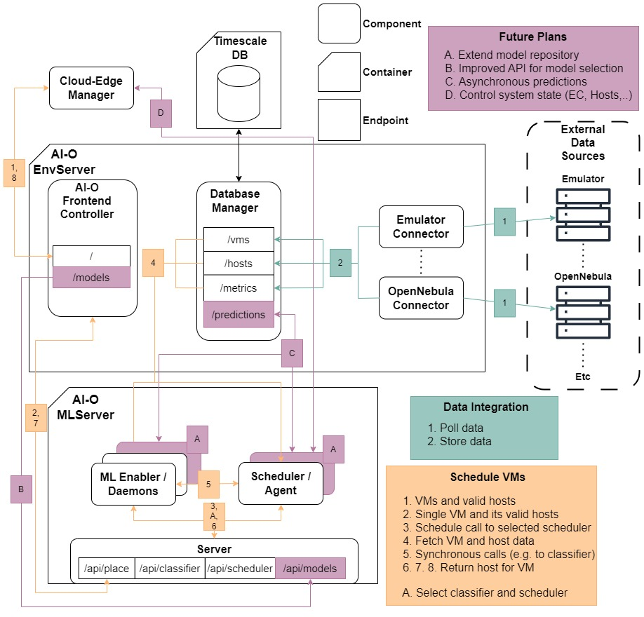

# AI-Orchestrator
Architecture diagram:




The AI-O EnvServer is at: \
https://github.com/SovereignEdgeEU-COGNIT/ai-orchestrator/tree/main/EnvServer

The AI-O MLServer is at:\
https://github.com/SovereignEdgeEU-COGNIT/ai-orchestrator/tree/main/MLServer

The ML model project is at:\
https://github.com/SovereignEdgeEU-COGNIT/ai-orchestrator/tree/main/ml-models

## How to Run

Doesn't require building beforehand. Get's docker images from Docker Hub
```bash
vim .env # Change environment variables accordingly
docker compose --file=./docker-compose-one.yml up # Changes images accordingly if modified
```

Expects the following in .env
```bash
export LANG=en_US.UTF-8
export LANGUAGE=en_US.UTF-8
export LC_ALL=en_US.UTF-8
export LC_CTYPE=UTF-8
export TZ=Europe/Stockholm
export ENVSERVER_VERBOSE="false"        # Verbose logging
export ENVSERVER_HOST="envserver"       # Address to the Database manager/envserver
export ENVSERVER_PORT="50080"           # Port for the Database manager/envserver
export ENVSERVER_TLS="false"            # TLS for the Database manager/envserver
export ENVSERVER_DB_HOST="timescaledb"  # Address to the Timescale DB
export ENVSERVER_DB_USER="postgres"     # User credentials for the Timescale DB
export ENVSERVER_DB_PORT="5432"         # Port for the Timescale DB
export ENVSERVER_DB_PASSWORD="pass"     # User credentials for the Timescale DB
export PROMETHEUS_HOST="IP"             # Address to the Prometheus server
export PROMETHEUS_PORT="PORT"           # Port for the Prometheus server
export ONED_PASS="pass"                 # User credentials for OneD
export ONED_ADDR="addr"                 # Address to OneD
export ML_PORT="50090"                  # Port for the MLServer
export ML_HOST="mlserver"               # Address to MLServer
export ML_INSECURE="false"              # TLS to MLServer
```

## Testing

[EnvServer](https://github.com/SovereignEdgeEU-COGNIT/ai-orchestrator/blob/main/EnvServer/README.md#Testing)
[MLServer](https://github.com/SovereignEdgeEU-COGNIT/ai-orchestrator/blob/main/MLServer/README.md#Testing)

#### ML Models
[IDEC testing](https://github.com/SovereignEdgeEU-COGNIT/ai-orchestrator/blob/main/ml-models/Idec/README.md)
[MC2PCA testing](https://github.com/SovereignEdgeEU-COGNIT/ai-orchestrator/blob/main/ml-models/MC2PCA/README.md)